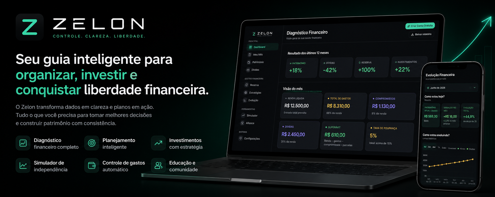
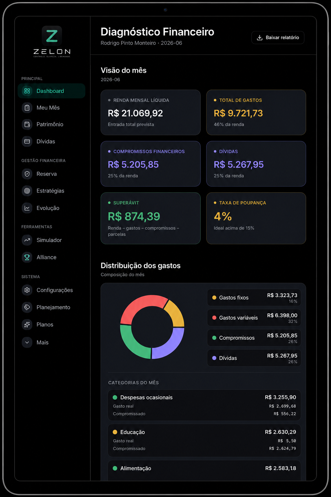
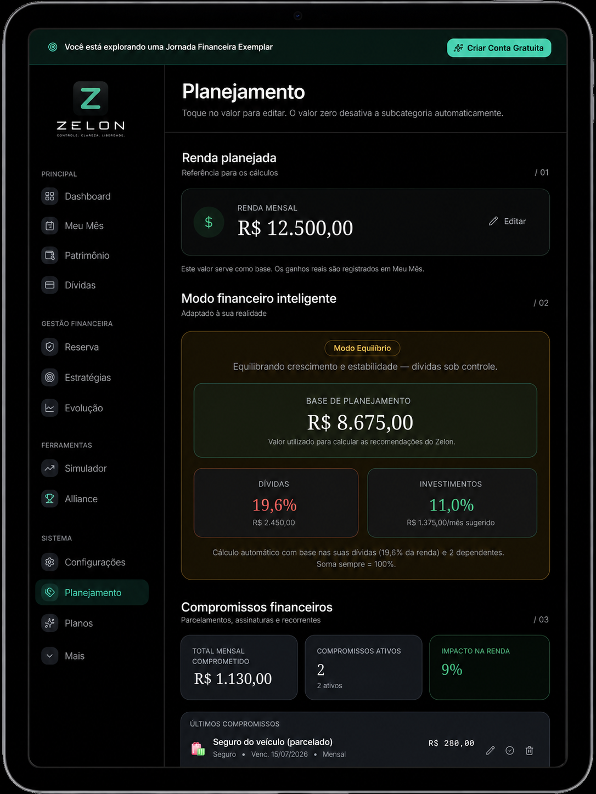
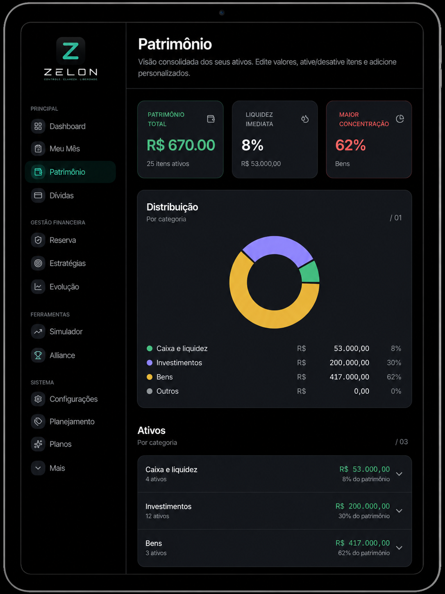
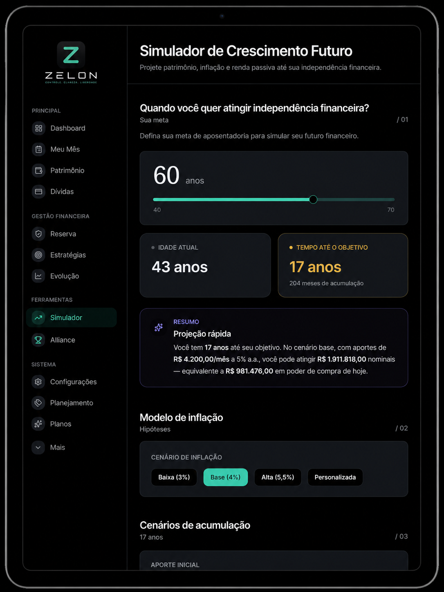
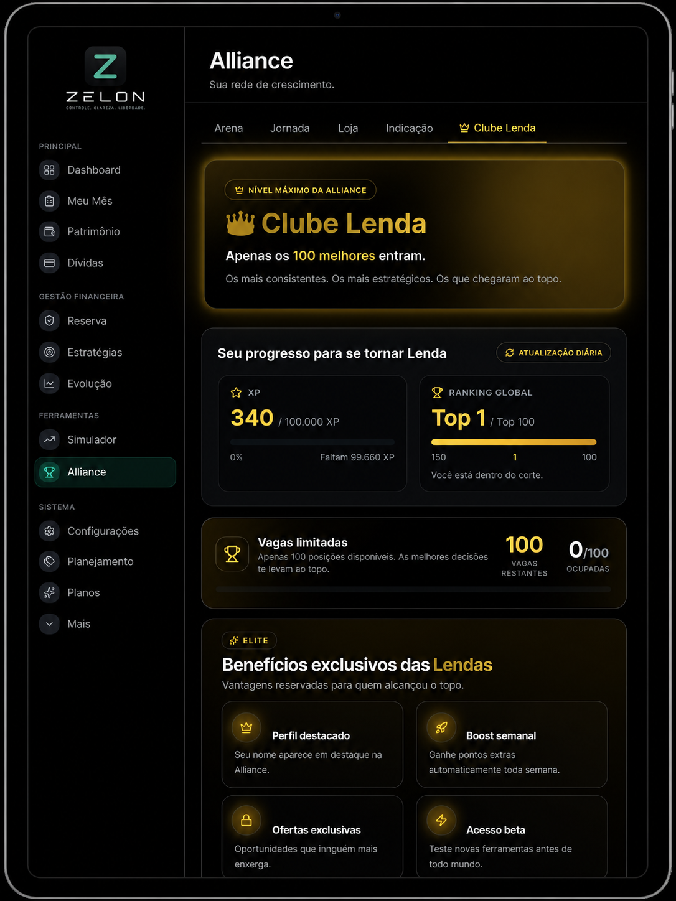
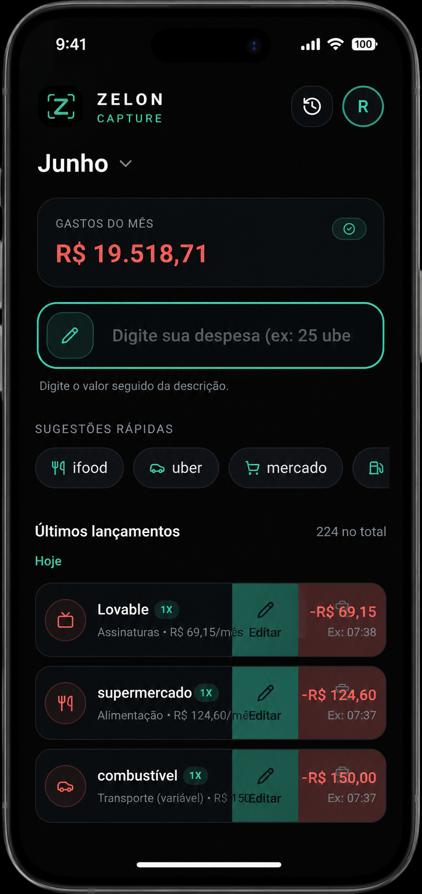

# Zelon

<p align="center">
  
</p>

<p align="center">
  <strong>Controle. Clareza. Liberdade.</strong>
</p>

<p align="center">
  Plataforma de Evolução Financeira Pessoal
</p>

<p align="center">
  <a href="https://www.zelon.com.br">Aplicativo</a> •
  <a href="./Docs/vision.md">Vision</a> •
  <a href="./Docs/roadmap.md">Roadmap</a> •
  <a href="./Docs/founder-story.md">Founder Story</a> •
  <a href="./Docs/design-system.md">Design System</a>
</p>

---

# Visão Geral

O Zelon é uma plataforma de evolução financeira pessoal criada para ajudar pessoas a organizar suas finanças, construir patrimônio e alcançar independência financeira.

Diferente de aplicativos focados apenas em registrar despesas, o Zelon foi desenvolvido para transformar dados financeiros em clareza, direção e progresso.

A plataforma integra planejamento financeiro, acompanhamento patrimonial, simulações futuras, estratégias financeiras e mecanismos de engajamento em um único ecossistema.

---

# Nossa Missão

Ajudar pessoas a desenvolverem uma relação mais saudável com o dinheiro através de clareza financeira, planejamento inteligente e evolução contínua.

---

# Nossa Visão

Construir a principal plataforma de evolução financeira pessoal da América Latina.

---

# Filosofia de Produto

O Zelon foi construído sobre quatro princípios fundamentais.

## Clareza acima de Complexidade

Informações financeiras devem ser fáceis de entender.

---

## Consistência acima de Perfeição

Pequenos avanços constantes geram grandes resultados ao longo do tempo.

---

## Evolução acima de Controle

O objetivo não é apenas controlar dinheiro.

É construir uma vida financeira melhor.

---

## Ação acima de Informação

Dados só têm valor quando geram decisões.

---

# Product Showcase

## Dashboard Financeiro



Visualização consolidada da situação financeira.

---

## Planejamento Financeiro



Estrutura para organização financeira de curto, médio e longo prazo.

---

## Patrimônio



Monitoramento da evolução patrimonial ao longo do tempo.

---

## Simulador Financeiro



Projeções patrimoniais e estimativas de independência financeira.

---

## Alliance



Sistema de progressão financeira baseado em gamificação.

---

## Zelon Capture



Aplicativo complementar para captura rápida de receitas e despesas.

---

# Recursos Principais

## Dashboard

- Indicadores financeiros
- Evolução patrimonial
- Distribuição de despesas
- Situação financeira consolidada
- Métricas de desempenho

---

## Meu Mês

- Receitas realizadas
- Despesas realizadas
- Saldo mensal
- Comparação entre planejado e realizado

---

## Planejamento

- Planejamento financeiro
- Perfil de investidor
- Estratégias financeiras
- Recomendações personalizadas

---

## Patrimônio

- Ativos
- Passivos
- Patrimônio líquido
- Evolução patrimonial

---

## Dívidas

- Empréstimos
- Financiamentos
- Parcelamentos
- Planejamento de quitação

---

## Reserva de Emergência

- Meta ideal
- Valor acumulado
- Cobertura financeira
- Evolução da reserva

---

## Simulações

- Independência financeira
- Cenários futuros
- Crescimento patrimonial
- Comparação de estratégias

---

## Evolução Financeira

- Score financeiro
- Histórico financeiro
- Indicadores de progresso
- Marcos financeiros

---

# Futuro Paralelo

Uma funcionalidade exclusiva do Zelon.

Permite visualizar diferentes versões do futuro financeiro do usuário com base nas decisões tomadas hoje.

## Exemplos

### Cenário Atual

Mantendo os hábitos atuais.

### Cenário Zelon

Seguindo recomendações personalizadas da plataforma.

### Cenário Acelerado

Aumentando investimentos e reduzindo desperdícios.

O objetivo é transformar projeções financeiras em histórias compreensíveis e motivadoras.

---

# Alliance

Alliance é o sistema de evolução e engajamento do Zelon.

Foi criado para incentivar consistência através de elementos de progressão.

## Recursos

- XP
- Coins
- Missões
- Ranking
- Conquistas
- Clube Lenda
- Recompensas digitais

---

# Zelon Capture

Aplicativo complementar focado em registro rápido.

Exemplos de entrada:

```text
25 Uber
45 Mercado
18 Café
120 Farmácia
```

Os dados são interpretados automaticamente e integrados ao ecossistema Zelon.

---

# Ecossistema

## Zelon

Plataforma principal de evolução financeira.

---

## Zelon Capture

Captura rápida de dados financeiros.

---

## Zelon AI *(Em Desenvolvimento)*

Camada de inteligência financeira.

---

## Zelon Academy *(Planejado)*

Educação financeira integrada.

---

## Zelon Wealth *(Planejado)*

Gestão patrimonial avançada.

---

## Zelon Business *(Planejado)*

Planejamento financeiro para empreendedores.

---

# Arquitetura

## Frontend

- React
- TypeScript
- Vite
- Tailwind CSS
- shadcn/ui

---

## Backend

- Supabase
- PostgreSQL
- Row Level Security (RLS)
- Edge Functions

---

## Infraestrutura

- Progressive Web App (PWA)
- GitHub
- Stripe
- Cloud Deployment

---

# Estrutura do Repositório

```text
zelon-showcase/
│
├── README.md
│
├── docs/
│   ├── architecture.md
│   ├── building-zelon.md
│   ├── design-system.md
│   ├── engineering.md
│   ├── founder-story.md
│   ├── roadmap.md
│   └── vision.md
│
└── assets/
    ├── banners/
    ├── logo/
    ├── mockups/
    └── screenshots/
```

---

# Documentação

| Documento | Descrição |
|------------|------------|
| vision.md | Visão estratégica do produto |
| founder-story.md | História do fundador e origem do projeto |
| building-zelon.md | Processo de construção da plataforma |
| architecture.md | Arquitetura técnica |
| engineering.md | Filosofia de engenharia |
| design-system.md | Sistema de design |
| roadmap.md | Evolução planejada |

---

# Roadmap

Próximas iniciativas planejadas.

## IA Financeira

- Zelon Advisor
- Insights automáticos
- Diagnóstico inteligente

---

## Planejamento Avançado

- Metas financeiras
- Planejamento por objetivos
- Linha do tempo financeira

---

## Evolução Financeira 2.0

- Score avançado
- Plano de evolução
- Marcos financeiros

---

## Alliance Expansion

- Missões inteligentes
- Eventos da comunidade
- Liga Alliance

---

## Ecossistema

- Perfil unificado
- Integração total entre produtos
- Novas soluções financeiras

---

# Links

## 🌐 Website

https://site.zelon.com.br

---

## 📱 Aplicativo

https://www.zelon.com.br

---

## 🎯 Demonstração

https://www.zelon.com.br/demo

---

## 📚 Case Study

https://case.zelon.com.br

---

## 💻 Portfólio Técnico

https://technical-portfolio.zelon.com.br

---

# Nossa Ambição

Não queremos construir apenas mais um aplicativo financeiro.

Queremos construir uma plataforma capaz de ajudar pessoas a:

- Organizar
- Planejar
- Investir
- Evoluir
- Construir patrimônio
- Alcançar independência financeira

Tudo em um único ecossistema.

---

# Zelon

**Controle. Clareza. Liberdade.**
